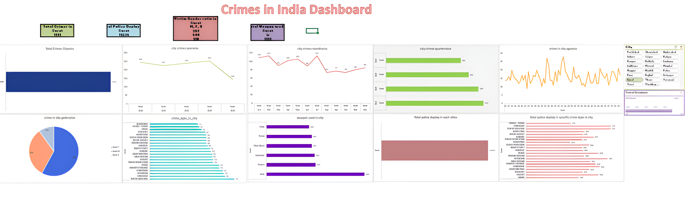

## 🖼 Preview

# 🔒 Crimes in India Dashboard
An interactive dashboard created in Microsoft Excel to analyze crime trends across Indian cities. This project highlights crime distribution, police deployment, and weapon usage, using intuitive visualizations.

## 📊 Key Features
- Total Crimes Reported
- Police Deployment Statistics
- Gender Distribution of Victims
- Weapons Used in Crimes
- Monthly and Quarterly Crime Trends
- City-Specific Crime Analysis
- Interactive Filters for City and Time Periods

## 🔧 Tools Used
- **Microsoft Excel**: Pivot Tables, Charts, Slicers

## 🔗 Insights
- Highest Crimes Reported: City A (example)
- Most Police Deployed: City B (example)
- Quarterly trends indicate a rise in crimes in Q3
